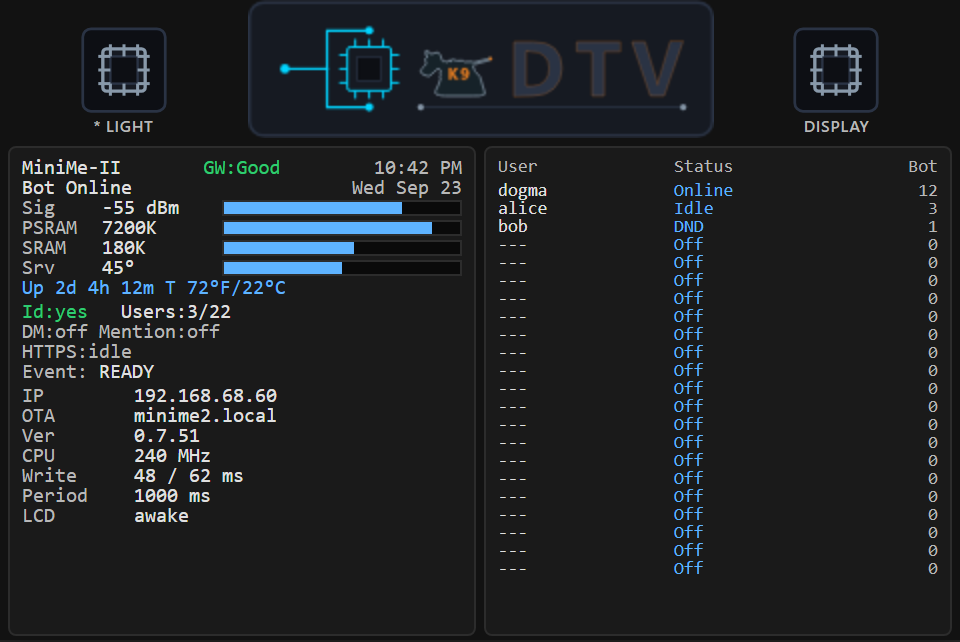
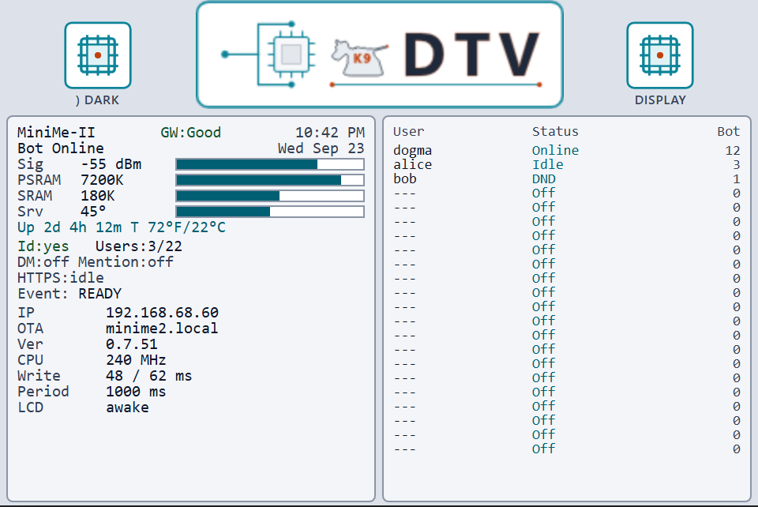
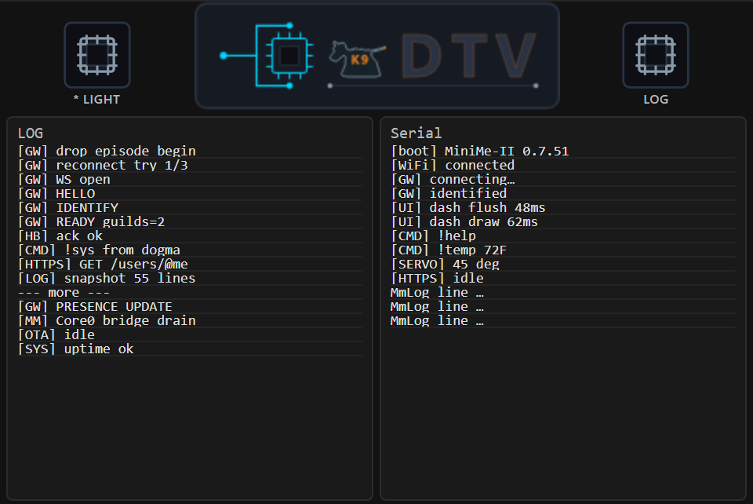
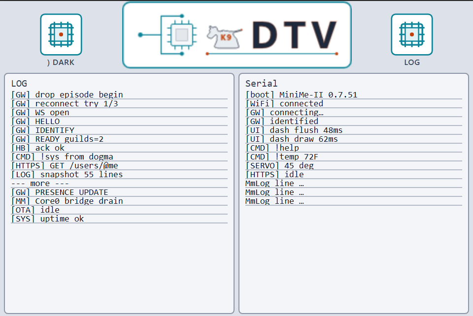
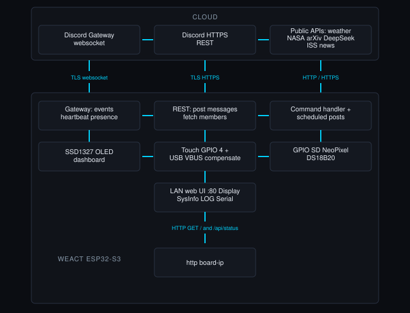

# MiniMe II -- Discord bot on Guition JC3248W535EN

[](https://github.com/K9DTV/minime-ii-esp32-discord-bot/actions/workflows/compile.yml)
[](https://github.com/K9DTV/minime-ii-esp32-discord-bot/actions/workflows/sanity.yml)
[](https://github.com/K9DTV/minime-ii-esp32-discord-bot/actions/workflows/python.yml)
[](https://github.com/K9DTV/minime-ii-esp32-discord-bot/actions/workflows/html.yml)

**Project page:** https://k9dtv.com/project-minime.html  
**Sister project:** [MiniMe I (SSD1327 OLED)](https://github.com/K9DTV/minime-esp32-discord-bot) -- not this repo.

MiniMe II is firmware for the **Guition JC3248W535EN** all-in-one module (ESP32-S3-N16R8 + **AXS15231B** color LCD with in-cell touch). This is **not** a breadboard build and **not** MiniMe I's OLED board.

**Display:** panel native **320x480** (portrait); firmware paints **480x320** landscape via **GFX Library for Arduino** (`Arduino_ESP32QSPI` + `Arduino_AXS15231B` + `Arduino_Canvas`). No SSD1327 / U8g2 and no capacitive GPIO wake pad.

**LCD <-> LAN web:** the glass dashboard and `http://<board-ip>/` are designed as a **close match** -- same Display (metrics|users) / Log (LOG|Serial) pairing and the same status fields (including internal SRAM bar + PSRAM free/total when present). Light/Dark on the glass and in the browser are **independent** (each has its own chip).

**Web UI and LCD UI still need work.** Both are a starting point — expect the left-hand window on the glass and in the browser to change as layouts and polish move. The firmware behind them is solid, well understood, and tested. A new function may land later; the main focus for now is the information shown to the user. Flash it, try Discord/`!help`, and poke the glass and the LAN page — just know the UI is early Guition work, not a finished product.

### LCD UI preview (not final)

This UI is **not done yet** and **will change**. The mocks below are 480×320 landscape from the current firmware layout (real K9DTV logo + menu chips). Dark | Light side by side.

**Display** (metrics | users)

| Dark | Light |
|:----:|:-----:|
|  |  |

**Log** (LOG | Serial)

| Dark | Light |
|:----:|:-----:|
|  |  |

Interactive HTML (all four): [`docs/lcd-mock/all-four.html`](docs/lcd-mock/all-four.html).

**Status:** Guition module firmware - **v0.7.51** (see `VERSION` / `CHANGELOG.md`). Pro-review fixed-vs-deferred: [`docs/CODE_REVIEW_NOTES.md`](docs/CODE_REVIEW_NOTES.md).

### Arduino libraries

1. Library Manager -> **GFX Library for Arduino** (moononournation) -> Install (build must include `Arduino_AXS15231B` / QSPI)
2. Also: ArduinoJson 7, WebSockets, OneWire, DallasTemperature, Adafruit NeoPixel, NTPClient

No **JC3248W535EN-Touch-LCD**, **JPEGDecoder**, or **U8g2**.

**If compile fails with `LIST_HEAD` / `Arduino_ESP32QSPI` / `Arduino_AXS15231B` does not name a type:**  
the IDE is using a **second, broken** GFX install. Arduino reports something like:

`Used: ...\libraries\Arduino_GFX`  
`Not used: ...\libraries\GFX_Library_for_Arduino`

**Fix (you do this in the Arduino libraries folder -- Cursor will not touch it):**

1. Quit Arduino IDE.  
2. **Move out of `libraries\` entirely** (Desktop/trash -- not a rename inside `libraries`) any folder still named `Arduino_GFX` or `Arduino_GFX_old`.  
3. Keep `GFX_Library_for_Arduino` (Library Manager's real package).  
4. Reopen IDE. Log must say `Used: ...\GFX_Library_for_Arduino` only.

**If those same errors continue with `GFX_Library_for_Arduino`:**  
GFX version and ESP32 core mismatch. Update GFX to latest, or pin the esp32 core (e.g. **3.3.5** / **3.2.1**). Check `...\GFX_Library_for_Arduino\library.properties` `version=` if it still fails.

After Wi-Fi connects, open `http://<board-ip>/` for the LAN dashboard (same Display/Log idea as the LCD).

License: see `LICENSE` (non-commercial for original MiniMe II files only; commercial use requires express written permission).

This is my second iteration of MiniMe. I have taken a much harder look at this project and am aiming for something that could be a real product — useful and reliable for people who use it.
AI helped with firmware edits, multi-file layout, and GitHub updates. I owned the architecture, wiring, Discord Gateway/LCD design, commands, power/idle trade-offs, and what shipped on the board.

## Ongoing project

- **LCD + LAN web UI** -- heavy redesign ahead; what you see now is a baseline to iterate on
- **Desk case / enclosure** for the Guition module (this is already the module board, not a breadboard prototype)
- **CI** -- four badges: **Compile** (Arduino), **Sanity** (fast host checks), **Python** (pytest + Pillow), **HTML** (LAN CSS/JS/SVG in headers). Local soak: [`docs/HIL_SOAK.md`](docs/HIL_SOAK.md) / `docs/lan-monitor.ps1`. Latest attested soak: [`docs/soak-results.md`](docs/soak-results.md).

Done recently: dual-core LCD vs Gateway, Display/Log + Light/Dark chips, DM/@mention flags, dirty redraw, Wi-Fi ArduinoOTA (`!ota`), LAN dashboard matched to the LCD layout, ArduinoJson 7, `!ask` HOL, Core0 log bridge.

---

## What this bot can do

Same list Discord shows for `!help`:

**Public commands** (DMs, `TARGET_CHANNEL_ID`, or `TARGET_CHANNEL_ID1`):

- `!apod` -- NASA Astronomy Picture of the Day
- `!ask <question>` -- DeepSeek text reply in chat
- `!display <text>` -- transient overlay on the LCD
- `!help` -- this command list
- `!iss` -- International Space Station position
- `!news` -- space / high-tech headlines
- `!physics` -- latest arXiv physics papers
- `!sys` -- system diagnostics (uptime, internal heap, PSRAM, RSSI, gateway, firmware URL)
- `!temp` -- indoor DS18B20 temperature
- `!time` -- bot local time (US Pacific, DST aware)
- `!weather <zip>` -- US ZIP weather (OpenWeatherMap)

**Owner-only** (`OWNER_ID_STR`):

- `!ota` -- Wi-Fi ArduinoOTA info (IP / hostname / port 3232)
- `!coredump` -- last panic from flash coredump (`!coredump clear` erases)
- `!servo <0-90>` -- servo angle (updates the `Srv` bar; optional external servo on GPIO 17)
- `!clear` -- clear DM / mention alert flags on the LCD

This Guition module has **no LED1 / LED2** and **no on-board RGB**. `!led` is not shipped (no handler).

### Channel / DM commands

Commands work in `TARGET_CHANNEL_ID`, `TARGET_CHANNEL_ID1`, and DMs. **No automatic boot posts**.

### Bot Discord presence

- Starts **Online** when the Gateway identifies
- Goes **Idle** after **5 minutes** with no activity
- Returns to **Online** on commands (touch does **not** set Online)

### `!ask` / DeepSeek

- Request `max_tokens`: **900**
- JSON parse buffer: **24576** bytes
- Discord post cap: **2000** characters
- HTTPS on the ESP32 can take several seconds (CA-verified TLS)
- Queued off the Gateway thread; heartbeats keep running while DeepSeek waits

## How it works

Everything below runs on one **ESP32-S3**. Discord stays in the cloud; MiniMe talks to it two ways, paints the LCD, serves a LAN web dashboard, and wakes the panel from in-cell touch.



*Same flowchart as the project page (diagram art may still show MiniMe I labels; this board is Guition + LCD).*

- **Gateway** -- live link for chat commands, presence, Online/Idle, heartbeats (must not stall during long HTTPS). Heartbeats start after Hello (jittered first send); a missing OP11 ACK past the Discord interval plus **15 s** grace forces disconnect (`HB_ACK_TIMEOUT`). **Identify-only** after drops (no session resume); one `beginSslWithBundle` at boot (ESP32 CA bundle -- not plain `beginSSL`/`setInsecure`), then library reconnect only.
- **REST** -- bot posts replies and loads member names; also pulls science/weather/AI over HTTPS/HTTP. Outbound TLS uses the ESP32 **CA cert bundle** (no `setInsecure`). One shared `WiFiClientSecure`; `httpsInUse` prevents overlapping HTTPS from `stop()`ing each other. Gateway WebSocket TLS uses the same CA blob via WebSockets `beginSslWithBundle`.
- **LCD** -- **480x320** landscape status board on the Guition panel (native **320x480**); idle blanks backlight only (Wi-Fi and Gateway stay up). Metrics + users (or LOG + Serial in Log layout). Redraw every **1 s** with dirty tracking. LAN API exposes the same fills as percents.
- **LAN web UI** -- browser twin of the LCD layout at `http://<board-ip>/` (close match; independent Light/Dark); polls `/api/status` every **2 s** (CSS/JS in `web_assets.h`). **MmLog** feeds web LOG/Serial only (no USB Serial / UART0 log dump).
- **Touch** -- wakes the LCD and hits the IC chips (theme / layout). Does not change Discord Online/Idle.

### Dual-core (ESP32-S3)

| Core | Owns |
|------|------|
| **1** (`loop`) | Discord Gateway + heartbeats, HTTPS REST, ArduinoOTA, LAN web server, command queue drain, `publishDashSnap` |
| **0** (`uiTask`) | Touch I2C, DS18B20 poll, `updateDisplay` / QSPI flush, backlight idle |

Shared UI state is a published **DashSnap** (seqlock; Core 1 writes, Core 0 paints). Discord `MESSAGE_CREATE` only enqueues; `handleCommand` runs from Core 1 `loop()` so TLS never runs inside the Gateway WebSocket callback. Mid-draw `pumpGateway()` is gone -- LCD flush no longer starves heartbeats.

**What dual-core fixes:** QSPI / touch / temp sensor no longer block Gateway heartbeats. Long HTTPS fetches (weather, news, APOD, ISS, physics, DeepSeek) run on Core 1 but body reads pump the Gateway via `readHttpBodyAfterHeaders` (same as DeepSeek). Chat still enters via the command queue -> `drainDiscordCmds` -> `handleCommand` (the stall length is the fetch itself; HB stays alive during the body wait).

### Why this is hard (on one MCU)

- Discord Gateway heartbeats must keep running while long HTTPS calls use the same TLS client (dual-core removes LCD/QSPI from that fight; fetch bodies pump HB via `readHttpBodyAfterHeaders`).
- Large Gateway JSON lives in **PSRAM**; small Wi-Fi/TLS buffers must **not**.
- Backlight can turn off while Wi-Fi and the Gateway stay up (panel sleep != chip sleep).
- Up to **24** live presence rows + 24h command counts on one landscape panel.

---

## LCD dashboard

**Panel:** Guition JC3248W535EN AXS15231B, native **320x480**, firmware canvas **480x320** landscape (`Arduino_Canvas`). Layout in `display_draw.cpp` / `dash_snap.cpp` (`drawDashboard` + `DashSnap` dirty tracking).

The LAN page is meant to **match** this layout (Display = metrics|users, Log = LOG|Serial). Glass and browser Light/Dark stay independent.

<details>
<summary><strong>LCD panels, chips, !display, and backlight sleep</strong></summary>

### Modes (right IC chip)

| Chip label | Left window | Right window |
|---|---|---|
| **Display** | Metrics (header, bars, Id/Users, DM/Mention, HTTPS, Event, Sys rows) | Users (name / status / Bot:N), up to **24** rows @ **9 px** pitch |
| **Log** | LOG ring | Serial ring |

Right chip is LCD-only (**independent** of the LAN Display/Log layout). Left IC chip toggles **Light / Dark** palette on the LCD only (**independent** of the LAN web theme).

Header band: K9DTV logo (`k9dtv_logo_rgb565.h` -- dark + bright RGB565) + two menu-chip style buttons. Regenerate with `python MinimeII/tools/gen_k9dtv_logo_rgb565.py` (Playwright Chromium + Pillow) from site dark/bright SVGs.

Empty user slots show `---`. Names from startup REST member fetch (nick -> global name -> username). Presence from the Gateway. Command counts reset every 24 hours.

DM to the bot and @mention of `OWNER_ID_STR` set **DM** / **Mention** flags on the left panel; owner `!clear` clears them.

### `!display`

- Public command.
- Only the text after `!display` is shown.
- Cap **50** characters across two transient lines.
- Stays **6 seconds**. A new `!display` overwrites and restarts the timer.

### Backlight sleep

After **5 minutes** with no real events, backlight turns **off**. That is panel power only. The microcontroller, Wi-Fi, and Discord Gateway keep running.

These **wake** the panel and restart the **5-minute** idle timer: **in-cell touch**, Discord commands, gateway connect/disconnect, `!display`, and other status overlays. Presence updates for user rows **do not** wake the panel.

Discord presence still goes Idle after **5 minutes** quiet (CPU drops to **160 MHz**; activity / OTA returns to **240 MHz**). Backlight sleep does not by itself change CPU clock.

</details>

---

## Fill in these values

Secrets live in **`MiniMe_Discord_Bot_II/secrets.h`** (gitignored; keep real secrets **outside** this workspace). No sketch source file holds Wi-Fi, tokens, or IDs.

1. Copy `MiniMe_Discord_Bot_II/secrets.example.h` -> `secrets.h` (on your machine, outside the repo if that is your rule)
2. Fill in real values and **delete** the `#define MINIME_SECRETS_IS_EXAMPLE 1` line (compile errors if it remains).

```cpp
#define WIFI_SSID            "ssid"
#define WIFI_PASSWORD        "password"
#define BOT_TOKEN            "bot token"
#define WEATHER_API_KEY      "WEATHER_API_KEY"
#define NASA_API_KEY         "NASA_API_KEY"
#define DEEPSEEK_API_KEY     "DEEPSEEK_API_KEY"
#define BOT_GUILD_ID         "GUILD_ID"  // startup member fetch
#define OWNER_ID_STR         "OWNER_ID_STR"         // servo / !clear + mention alert
#define TARGET_CHANNEL_ID    "TARGET_CHANNEL_ID"    // commands
#define TARGET_CHANNEL_ID1   "TARGET_CHANNEL_ID1"   // second command channel
#define OTA_HOSTNAME         "minime2"
#define OTA_PASSWORD         "change-me-ota"
```

Use `#define` (not `const char*`) so every `.cpp` can include `secrets.h` without linker "multiple definition" errors.

| Field | Used for |
|---|---|
| `WIFI_SSID` / `WIFI_PASSWORD` | ESP32 station Wi-Fi |
| `BOT_TOKEN` | Discord Gateway + REST |
| `WEATHER_API_KEY` | OpenWeatherMap `!weather` |
| `NASA_API_KEY` | NASA APOD for `!apod` |
| `DEEPSEEK_API_KEY` | DeepSeek for `!ask` |
| `BOT_GUILD_ID` | One guild to load members from at boot |
| `OWNER_ID_STR` | Who can run servo / `!clear`; mention alert target |
| `TARGET_CHANNEL_ID` | Commands (no automatic boot posts) |
| `TARGET_CHANNEL_ID1` | Second channel where commands are allowed |
| `OTA_HOSTNAME` / `OTA_PASSWORD` | ArduinoOTA network port |

IDs are **digits only**. Paste them as C strings, for example `"123456789012345678"`.

Boot loads LCD names from `BOT_GUILD_ID` and from the guilds of the target channels. Duplicate users are stored once. Slots are split across those guilds, then leftover rows are filled.

<details>
<summary><strong>How to get a Discord bot token (<code>BOT_TOKEN</code>)</strong></summary>

1. Open [Discord Developer Portal](https://discord.com/developers/applications) and sign in.
2. **New Application** -> name it -> Create.
3. Left sidebar: **Bot** -> **Add Bot** if needed.
4. Under **Token**, **Reset Token** / **Copy** -> `BOT_TOKEN` in `secrets.h`.
5. Enable **Privileged Gateway Intents**: Message Content, Server Members, Presence. If any are off, Discord closes the socket right after Identify (often no `READY` / `OP9` in our log -- close can look like a bare `WS_DISCONNECTED_WIFI_UP` loop).
6. Identify intents: `INTENTS_MINIME` in `minime_config.h` (`static_assert` checks `== 37635`). Boot log: `[GW] intents=37635`.

### Invite the bot to your server

1. Developer Portal -> **OAuth2** -> **URL Generator**.
2. Scopes: `bot`. Minimum permissions: View Channels, Send Messages, Read Message History.
3. Open the URL, pick your server, authorize.
4. The bot stays offline until the ESP32 connects.

</details>

<details>
<summary><strong>How to get your owner ID (<code>OWNER_ID_STR</code>)</strong></summary>

This is **your Discord user ID**, not the bot's ID.

1. Discord: **User Settings** -> **Advanced** -> enable **Developer Mode**.
2. Right-click **your own avatar** -> **Copy User ID**.
3. Paste into `OWNER_ID_STR` in `secrets.h`.

</details>

<details>
<summary><strong>How to get channel and guild IDs</strong></summary>

Developer Mode must be on.

- **Channel:** right-click the text channel -> **Copy Channel ID**.
- **Guild / server:** right-click the server icon -> **Copy Server ID** -> `BOT_GUILD_ID`.

The bot must be able to **see and send** in those channels.

</details>

<details>
<summary><strong>How to get an OpenWeatherMap key (<code>WEATHER_API_KEY</code>)</strong></summary>

1. Free account at [OpenWeatherMap](https://home.openweathermap.org/users/sign_up).
2. [API keys](https://home.openweathermap.org/api_keys) -> paste into `WEATHER_API_KEY`.
3. New keys can take a few hours. `!weather` uses `zip={zip},US` and `units=imperial`.

</details>

---

## Science / physics commands

| Command | Source | Key? |
|---|---|---|
| `!news` | [Spaceflight News API](https://api.spaceflightnewsapi.net/) -- 3 headlines | No |
| `!physics` | [arXiv](https://arxiv.org/) `cat:physics` -- 3 newest papers | No |
| `!apod` | [NASA APOD](https://api.nasa.gov/) -- title, short explanation, image URL | Yes |
| `!iss` | [Open Notify](http://open-notify.org/) -- ISS lat / lon | No |

<details>
<summary><strong>How to get a NASA key (<code>NASA_API_KEY</code>)</strong></summary>

1. [api.nasa.gov](https://api.nasa.gov/) -> free key -> paste into `NASA_API_KEY`.
2. `DEMO_KEY` works for light testing but is shared and rate-limited.

</details>

<details>
<summary><strong>How to get a DeepSeek key (<code>DEEPSEEK_API_KEY</code>)</strong></summary>

1. [DeepSeek Platform](https://platform.deepseek.com/) -> [API Keys](https://platform.deepseek.com/api_keys).
2. Paste into `DEEPSEEK_API_KEY`. Replies capped at **2000** characters.

</details>

---

## Hardware (default pins)

Board: **Guition JC3248W535EN** module (ESP32-S3-N16R8 + AXS15231B LCD + in-cell touch). Not a breadboard; not MiniMe I.

**Display:** native **320x480**; firmware **480x320** landscape (`Arduino_ESP32QSPI` + `Arduino_AXS15231B` + Canvas).

| Device | GPIO |
|---|---|
| LCD backlight | 1 |
| LCD QSPI CS / SCK / D0–D3 | 45 / 47 / 21 / 48 / 40 / 39 |
| Touch I2C SDA / SCL / INT | 4 / 8 / 3 |
| Servo (optional external) | 17 |
| DS18B20 data (optional external) | 10 |

Change pins in `minime_config.h` if your wiring differs. **No LED1 / LED2**, **no on-module RGB**, **no** `!set1` / `!set2`, **no** USB VBUS ADC (GPIO 1 is backlight).

### DS18B20 (GPIO 10, if fitted)

TO-92, powered from **3.3 V**. Internal pull-up enabled; a **4.7 kohm** DQ->3.3 V resistor is still recommended.

| TO-92 lead (flat toward you, leads down) | Connect to |
|---|---|
| Left | GND |
| Middle (DQ) | GPIO 10 |
| Right (VDD) | 3.3 V |

`!temp` uses this sensor. On failure: Discord `Temperature sensor error.` and LCD `T --Error--`.

---

## Touch (in-cell)

Capacitive touch on the AXS15231B wakes the LCD after backlight-off and hits the theme / layout chips.

<details>
<summary><strong>Touch behavior</strong></summary>

- I2C: SDA **4**, SCL **8**, INT **3**, addr **0x3B** (`minime_config.h`).
- `pollTouchWake()` in `loop()`; debounce **300 ms**.
- No USB VBUS ADC and no separate capacitive GPIO wake pad.

### What touch does *not* do

- Does not send Discord messages, set Discord Online/Idle, or move the servo by itself.
- The ESP32, Wi-Fi, and Gateway **never sleep** -- only the backlight turns off.

</details>

---

## Arduino IDE setup

GitHub Actions runs **Compile**, **Sanity**, **Python**, and **HTML** on push (badges above). None upload or talk to the board. Local soak: [`docs/HIL_SOAK.md`](docs/HIL_SOAK.md). Attested results: [`docs/soak-results.md`](docs/soak-results.md).

1. Install [Arduino IDE](https://www.arduino.cc/en/software) and the **esp32** board package (Espressif).
2. Open **only** `MiniMe_Discord_Bot_II/MiniMe_Discord_Bot_II.ino` from a folder that contains that **single** `.ino` plus the `.cpp` / `.h` files and `partitions.csv`. Arduino merges every `.ino` in the folder into one translation unit — a leftover `Discord_Bot_MiniMe_II.ino` (or any second `.ino`) causes `redefinition of 'void connectWiFi()'` / `setup` / stack helpers. Delete extras; folder name should match the one `.ino` basename.
3. Provide `secrets.h` (from `secrets.example.h`) with Wi-Fi, token, keys, and IDs.
4. Set **Tools** as in the table below for this **Guition N16R8** module.
5. Libraries: GFX Library for Arduino, WebSockets, ArduinoJson, OneWire, DallasTemperature, Adafruit NeoPixel, NTPClient.
6. Upload. Confirm with Discord `!help` and the LAN page header (`Display - v` + `MINIME_VERSION` / `VERSION`). Tap the glass to wake after backlight off.

### Required Tools settings (N16R8)

| Tools menu | Setting for MiniMe II |
|---|---|
| **Board** | **ESP32S3 Dev Module** (not generic ESP32 Dev Module) |
| **USB CDC On Boot** | **Enabled** (upload / OTA; Monitor stays quiet -- logs on LAN web UI) |
| **USB Mode** | **Hardware CDC and JTAG** |
| **Flash Size** | **16MB (128Mb)** |
| **Flash Mode** | **QIO 80MHz** (typical) |
| **Partition Scheme** | Sketch **`partitions.csv`**: dual OTA apps (~7.9MB each), **no SPIFFS**. Prefer **Custom** when offered. |
| **PSRAM** | **OPI PSRAM** |
| **PSRAM frequency** (if shown) | **80MHz** (or board default) |
| **Arduino Runs On** / **Events Run On** | **Core 1** (keep default). Firmware pins LCD `uiTask` to **Core 0**; leave Arduino/Events on Core 1. |
| **USB DFU On Boot** | Disabled (unless needed) |
| **Upload Mode** | **UART0 / Hardware CDC** |
| **Upload Speed** | **921600** (or lower if uploads fail) |

### RAM / flash notes

- **RAM:** internal SRAM + **8MB OPI PSRAM**. **PSRAM -> OPI PSRAM** must be on.
- Large Discord Gateway JSON (`GW_DOC_PSRAM` soft size) and LAN `statusDoc` use `JsonDocument` with `SpiRamAllocator` (PSRAM via `heap_caps_*`). Default `JsonDocument` is internal SRAM only.
- Do **not** enable `heap_caps_malloc_extmem_enable` for small allocations (Wi-Fi / TLS in PSRAM can crash).
- **Flash:** **16MB**. `partitions.csv` is dual OTA + small coredump -- **no filesystem**. First flash USB; later Wi-Fi OTA (`!ota`).

---

## Safety

- Never commit firmware that contains a live bot token, API key, password, or Discord snowflake ID.
- Keep real `secrets.h` **out of** this workspace. `secrets.example.h` only in-repo.
- If a token leaks, reset it in the Developer Portal immediately.

---

## License

Original MiniMe II source, README, changelog, and docs in this repo are under a
**non-commercial** license: personal and educational use is allowed; commercial
use requires the copyright holder's prior express written permission. See `LICENSE`.

That grant does **not** cover Arduino/ESP32 libraries, Discord, or other APIs. Install the libraries under **Arduino IDE setup** and follow each service's rules for keys and bots.
